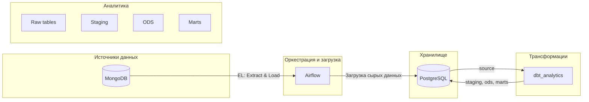
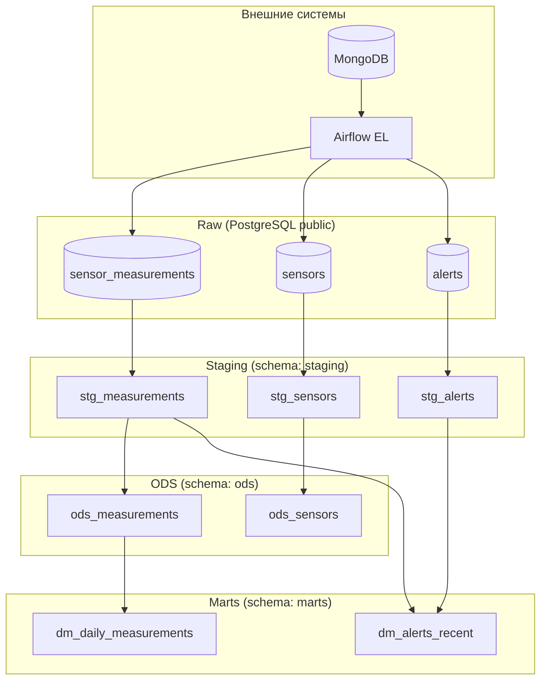

# Архитектура проекта (UML)

## 1. Диаграмма верхнего уровня — полный контур данных



## 2. Компонентная диаграмма — слои и потоки данных



## 3. Развёртывание (окружения)

```mermaid
flowchart TB
    subgraph people[""]
        dev[Разработчик]
        prod[CI/CD]
    end

    subgraph systems["Системы"]
        mongo[(MongoDB)]
        airflow[Airflow]
        dbt[dbt_analytics]
        db[(PostgreSQL)]
    end

    dev -->|dbt run dev| dbt
    prod -->|dbt run prod| dbt
    airflow -->|EL| mongo
    airflow -->|Load raw| db
    dbt -->|Build models| db
```

## 4. Краткое описание слоёв

| Слой      | Схема   | Назначение |
|-----------|---------|------------|
| **MongoDB** | —     | Исходные данные: сенсоры, измерения, алерты. |
| **Airflow** | —     | EL: извлечение из MongoDB и загрузка в PostgreSQL (raw). |
| **Raw**   | public  | Сырые таблицы в PostgreSQL: sensor_measurements, sensors, alerts. |
| **Staging** | staging | Приведение типов, ключи (pk), обогащение. |
| **ODS**   | ods     | Бизнес-правила, валидация. |
| **Marts** | marts   | Витрины: дневные агрегаты, недавние алерты. |

Тесты: Elementary + кастомные (`tests/assert_*.sql`).
